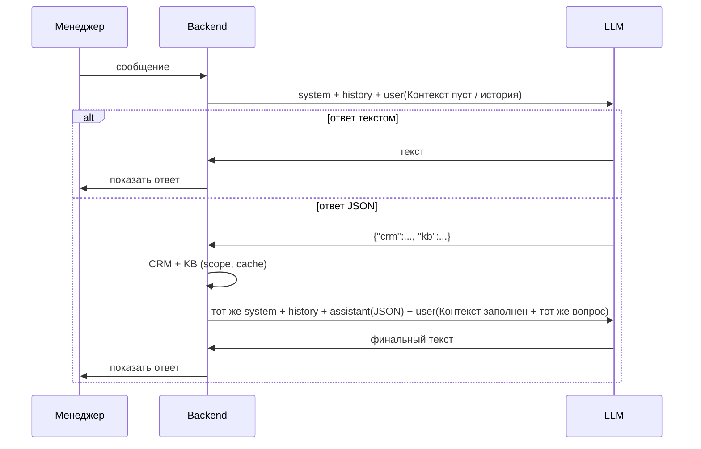

Doc ID: ARCH-AGENT-001
Status: draft
Source of truth: yes
Owner: backend
Related docs: docs/architecture/integrations.md, docs/architecture/api-contracts.md
Update trigger: изменение промптов, JSON-плана или flow agent chat
Review required: backend, product
Maturity: L1

# AI Agent — orchestrator (plan + context)

Один system prompt на всю сессию. **Второго «synthesize»-промпта нет.**  
После запроса данных backend подставляет результат в поле **Контекст** следующего user-сообщения (или в ту же цепочку `messages[]`).

## User flow (MVP)



## Разбор ответа LLM

| Ответ | Действие |
|-------|----------|
| Начинается с `{` | Парсим JSON → запросы в CRM/KB |
| Иначе | Готовый ответ пользователю, CRM/KB не вызываем |
| JSON битый | Один retry «только JSON»; fallback regex для ID лида (`TW26055`) |

## Поле «Контекст» в user-сообщении

Backend собирает user-блок **каждый** вызов LLM:

```text
Контекст:
{context_block}

Вопрос менеджера:
{user_message}

Клиент (форма): {client_name}
Комментарий (форма): {client_note}
```

| Ситуация | `context_block` |
|----------|-----------------|
| Первый вызов, данных ещё нет | `Контекста нет.` |
| После fetch CRM/KB | Блоки `--- CRM ---` / `--- БАЗА ЗНАНИЙ ---` (см. ниже) |
| Платный agent/session (будущее) | Может быть пустым — см. раздел ниже |

### Пример контекста после fetch

```text
--- CRM ---
Клиент TW26055: Владимир | этап: 5 ДОЖАТИЕ | статус: АВАНС

--- БАЗА ЗНАНИЙ ---
• [objection] Работа с «дорого»: ...
```

Если база пуста:

```text
--- БАЗА ЗНАНИЙ ---
По запросу статей не найдено.
```

LLM в **том же system prompt** уже знает: при пустой базе можно опираться на общие знания, но написать *«Ответ не опирается на вашу базу знаний.»*

## System prompt

Текст canonical — в коде: `apps/api/ai/services/agent_prompts.py` → `AGENT_SYSTEM_PROMPT`.

Плейсхолдеры подставляет backend:

| Плейсхолдер | Источник |
|-------------|----------|
| `{manager_full_name}` | `User.full_name` |
| `{tenant_name}` | `Tenant.name` |

Workspace, ОП, роль — **не** в промпт; scope CRM режет backend.

## JSON-план (если нужны данные)

```json
{
  "crm": {
    "search": "...",
    "stage": "...",
    "status": "...",
    "count": false
  },
  "kb": {
    "query": "..."
  }
}
```

Маппинг на backend:

| JSON | Backend |
|------|---------|
| `crm.search` | `CrmQueryFilters.search` (+ phone, comment в live filter) |
| `crm.stage` | `pipeline_stage` + `crm_vocabulary` |
| `crm.status` | `status_stage` + `crm_vocabulary` |
| `crm.count: true` | `mode=count` |
| `kb.query` | `search_knowledge(actor, query)` |

Session state (TODO): `last_search` для follow-up («у него статус?»).

## One-shot vs agent session (LLM API)

### MVP (сейчас) — stateless messages[]

Каждый HTTP-вызов к OpenRouter — массив `messages`: `[system, …history, user]`.

- История хранится у **нас** в `AgentChatMessage`.
- После fetch backend **сам** добавляет в цепочку:
  - `assistant`: JSON-план (как вернула модель)
  - `user`: тот же вопрос + заполненный **Контекст**
- System prompt **тот же** на каждом шаге — отдельного PROMPT 2 нет.

### Платные модели / «режим агента» (будущее)

У части провайдеров есть **persistent thread** (один `conversation_id`, модель «помнит» в рамках сессии без повторной передачи всего контекста).

| | MVP (messages[]) | Agent session (будущее) |
|--|------------------|-------------------------|
| История | Django `AgentChatMessage` | Thread у провайдера + наша БД |
| Контекст CRM/KB | Явное поле в user | Tool result / message injection |
| System prompt | Каждый запрос | Один раз при создании thread |
| Free router | `openrouter/free` | Зависит от провайдера |

**Важно:** пока используем MVP. В коде не полагаться на «модель сама помнит» — всегда передавать историю и **Контекст** явно. При переходе на agent session документ и `agent_prompts.py` обновить.

## Что backend решает сам (не в промпт)

- Подключён ли CRM (есть `IntegrationSource` с credentials)
- ManagerScope / employee scope
- Кэш Google Sheets (`read_sheet_rows_cached`)
- Content guard на user input
- Строка про CRM в system только если CRM доступен

## Связанный код

| Модуль | Назначение |
|--------|------------|
| `ai/services/agent_prompts.py` | System + user шаблоны |
| `ai/services/agent_orchestrator.py` | Plan → fetch → continue (тот же system) |
| `ai/services/agent.py` | `chat_with_agent`, история сессии |
| `ai/services/crm_tools.py` | `execute_crm_query`, `format_crm_result` (legacy intent helpers — deprecated для chat) |
