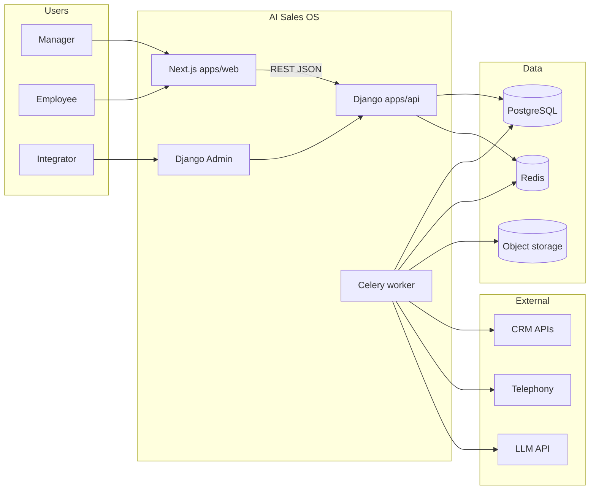

Doc ID: ARCH-SYSTEM-OVERVIEW-001
Status: active
Source of truth: yes
Owner: architecture
Related docs: docs/architecture/architecture-decisions/ADR-0001-django-nextjs-monorepo.md, docs/architecture/api-contracts.md, docs/architecture/data-model.md, docs/backend/backend-docs.md, docs/frontend/frontend-docs.md, docs/operations/environments.md, docs/architecture/stack.md
Update together with: api-contracts.md, data-model.md, backend-docs.md, frontend-docs.md
Update trigger: новый модуль, сервис, граница системы или смена стека
Review required: backend, frontend, operations
Maturity: L2

# System Overview

## Purpose

AI Sales OS — SaaS для контроля и развития отдела продаж: дашборды, разборы, AI-аналитика, RAG-агенты. User Level UI — Next.js; бизнес-логика и интеграции — Django API; фоновые задачи — Celery.

> Решение по стеку: [ADR-0001](architecture-decisions/ADR-0001-django-nextjs-monorepo.md)

## Stack (Variant A — active)

| Layer | Technology | Role |
|---|---|---|
| Frontend | Next.js 15, React, TypeScript, Tailwind | User Level UI; tokens from design preview |
| API | Django 5 + Django REST Framework | REST `/api/v1/*`, business logic |
| API docs | drf-spectacular | OpenAPI schema |
| Auth (User) | JWT access + refresh | STAGE-001; tenant + scope in middleware |
| Auth (Integration) | Django Admin (session) | Integrator config, later |
| Database | PostgreSQL 16 + pgvector | Relational data + RAG embeddings (later) |
| Cache / broker | Redis 7 | Celery broker, KPI cache (later) |
| Workers | Celery | CRM sync, transcription, embeddings (STAGE-002+) |
| Object storage | S3-compatible (MinIO local) | Call recordings (STAGE-002+) |
| AI | Pluggable adapter → OpenAI API | Analytics, agents (STAGE-005+) |
| Local runtime | Docker Compose | postgres, redis, api, web, worker |
| Production | Managed cloud (TBD) | Railway / Render / Fly.io |

## System Context



## Monorepo Layout

```
/
├── apps/
│   ├── api/          # Django + DRF + Celery app
│   └── web/          # Next.js User Level UI
├── docs/             # Product & architecture docs
├── docker-compose.yml
└── .env.example
```

## Main Modules (Django apps)

| Module | Responsibility | Roadmap stage |
|---|---|---|
| `accounts` | Tenants, users, roles, permissions, JWT auth | STAGE-001 |
| `core` | Shared middleware, tenant scope, health | STAGE-001 |
| `integrations` | CRM/telephony adapters, webhooks | STAGE-002 |
| `analytics` | KPI aggregation, dashboards API | STAGE-003 |
| `reviews` | Review history, tasks | STAGE-004 |
| `ai` | RAG, agents, reports | STAGE-005–006 |

Frontend routes ↔ [pages-map.md](../project/design-guide/pages-map.md) — см. [frontend-docs.md](../frontend/frontend-docs.md).

## Data Flow (high level)

1. User → Next.js → JWT → Django API (tenant-scoped queryset).
2. Integrations → Celery task → external API → normalize → PostgreSQL.
3. Recordings → S3 → transcription job → transcript → AI evaluation (later).
4. Knowledge chunks → embeddings → pgvector → RAG retrieval (later).

## External Dependencies

См. [integrations.md](integrations.md) — CRM, telephony, LLM, storage (заполняется по мере подключения).

## Architecture Notes

- **Tenant isolation:** every tenant-scoped row has `tenant_id`; API middleware sets current tenant from JWT claims.
- **Ceiling rule:** permission grants cannot exceed grantor permissions (STAGE-001 business rule in `accounts`).
- **No Django templates** for User Level — only JSON API.
- **FastAPI:** deferred; see ADR-0001.

## Related ADR

- [ADR-0001 — Django + Next.js monorepo](architecture-decisions/ADR-0001-django-nextjs-monorepo.md)
