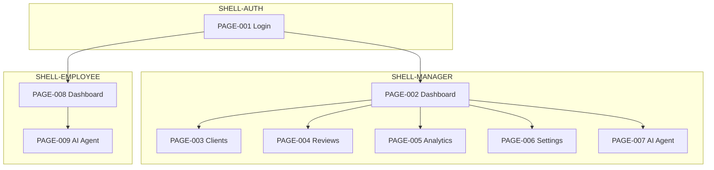

Doc ID: DESIGN-PAGES-MAP-001
Status: draft
Source of truth: yes
Owner: design
Related docs: docs/project/design-guide/work-rules-design-guide.md, docs/project/design-guide/design-system-preview/design-system-preview.md, docs/project/user-flow.md, docs/project/user-roles.md, docs/features/*
Update together with: work-rules-design-guide.md, design-system-preview.md, docs/project/user-flow.md
Update trigger: новая страница, зона, навигация, preview-файл или изменение shell
Review required: product, design
Maturity: L1

# Pages Map

Карта экранов User Level: Page ID, shell, зоны, навигация и подготовка к ASCII/HTML preview.

> Правила design-guide: `work-rules-design-guide.md`  
> Визуальный стиль: `design-system-format/ui-kit.md`  
> Индекс preview: `design-system-preview/design-system-preview.md`  
> Сценарии: `docs/project/user-flow.md`

## Document Role

| Документ | Что фиксирует |
|---|---|
| **pages-map.md** | структура экранов, зоны, shell, переходы, связи с FLOW/FEAT |
| **design-system-preview/PAGE-xxx-*.md** | детальный ASCII-wireframe и спецификация зон |
| **design-system-preview/PAGE-xxx-*.html** | HTML-рендер по `.md` |

## App Structure



## Page Index

| Page ID | Name | Route | Shell | Roles | Permission | Flow | Feature | Preview MD | Preview HTML |
|---|---|---|---|---|---|---|---|---|---|
| PAGE-001 | Login | `/login` | SHELL-AUTH | all | — | — | FEAT-001 | `PAGE-001-login.md` | `PAGE-001-login.html` |
| PAGE-002 | Manager Dashboard | `/manager` | SHELL-MANAGER | Руководитель | dashboard: view | FLOW-001 | FEAT-003 | `PAGE-002-manager-dashboard.md` | `PAGE-002-manager-dashboard.html` |
| PAGE-003 | Clients To Review | `/manager/clients` | SHELL-MANAGER | Руководитель | clients: view | FLOW-001 | FEAT-003 | `PAGE-003-clients-to-review.md` | `PAGE-003-clients-to-review.html` |
| PAGE-004 | Review History | `/manager/reviews` | SHELL-MANAGER | Руководитель | reviews: view/edit | FLOW-002 | FEAT-004 | `PAGE-004-review-history.md` | `PAGE-004-review-history.html` |
| PAGE-005 | AI Analytics | `/manager/analytics` | SHELL-MANAGER | Руководитель | analytics: view/run | FLOW-003 | FEAT-005 | `PAGE-005-ai-analytics.md` | `PAGE-005-ai-analytics.html` |
| PAGE-006 | System Settings | `/manager/settings` | SHELL-MANAGER | Руководитель | settings: view/edit | FLOW-004 | FEAT-001, FEAT-006 | `PAGE-006-system-settings.md` | `PAGE-006-system-settings.html` |
| PAGE-007 | AI Agent (Manager) | `/manager/agent` | SHELL-MANAGER | Руководитель | agent: use | FLOW-005 | FEAT-006 | `PAGE-007-ai-agent-manager.md` | `PAGE-007-ai-agent-manager.html` |
| PAGE-008 | Employee Dashboard | `/employee` | SHELL-EMPLOYEE | Сотрудник | dashboard: view | FLOW-006 | FEAT-004 | `PAGE-008-employee-dashboard.md` | `PAGE-008-employee-dashboard.html` |
| PAGE-009 | AI Agent (Employee) | `/employee/agent` | SHELL-EMPLOYEE | Сотрудник | agent: use | FLOW-007 | FEAT-006 | `PAGE-009-ai-agent-employee.md` | `PAGE-009-ai-agent-employee.html` |

Preview-файлы — в `design-system-preview/`. Routes черновые до `docs/frontend/frontend-docs.md`.

## Layout Shells

Общие каркасы для ASCII и HTML. Зоны одинаковы для всех страниц внутри shell, меняется только `Z-MAIN`.

### SHELL-AUTH — PAGE-001

| Zone ID | Назначение |
|---|---|
| Z-CENTER | центрированная форма входа |
| Z-FORM | email/login, password, submit |
| Z-FOOTER | служебные ссылки (опционально) |

```
+--------------------------- SHELL-AUTH ---------------------------+
|                                                                  |
|                    +--------------------------------+            |
|                    | Z-CENTER                       |            |
|                    |  [Logo] AI Sales OS            |            |
|                    |  Z-FORM: login / password      |            |
|                    |  [ Войти ]                     |            |
|                    +--------------------------------+            |
|                    Z-FOOTER (optional)                           |
|                                                                  |
+------------------------------------------------------------------+
```

### SHELL-MANAGER — PAGE-002 … PAGE-007

Layout: **AI Control Dashboard** — sidebar + main + optional insight panel.  
Детали стиля: `design-system-format/page-layout-rules.md`.

| Zone ID | Назначение |
|---|---|
| Z-SIDEBAR | logo, nav (glass), выбор подразделения, settings, logout |
| Z-PAGE-HEADER | заголовок + subtitle (в Z-MAIN) |
| Z-TOOLBAR | filter chips, primary action |
| Z-CONTENT | cards grid, tables, chat — уникален для Page ID |
| Z-INSIGHT | AI-сводка, quick stats (optional, см. page-layout-rules) |
| Z-TOAST | уведомления (overlay) |

`Z-MAIN` = Z-PAGE-HEADER + Z-TOOLBAR + Z-CONTENT.

```
+--------------------------- SHELL-MANAGER ---------------------------+
| +-------------+----------------------------------+------------------+ |
| | Z-SIDEBAR   | Z-MAIN                           | Z-INSIGHT        | |
| | [Logo]      | Z-PAGE-HEADER: Title / subtitle  | AI summary       | |
| | o Dashboard | Z-TOOLBAR: [chips] [Primary CTA] | Quick alerts   | |
| |   Clients   | Z-CONTENT:                       |                  | |
| |   Reviews   |   [ metric ] [ metric ] [ metric]|                  | |
| |   Analytics |   [ chart / table / chat       ] |                  | |
| |   AI Agent  |                                  |                  | |
| |   Settings  |                                  |                  | |
| | [Subdivision|                                  |                  | |
| |  Settings   |                                  |                  | |
| |  Logout     |                                  |                  | |
| +-------------+----------------------------------+------------------+ |
+---------------------------------------------------------------------+
```

Active nav item в Z-SIDEBAR = текущий Page ID (glow pill, `--accent-blue`).

### SHELL-EMPLOYEE — PAGE-008 … PAGE-009

| Zone ID | Назначение |
|---|---|
| Z-SIDEBAR | logo, nav (2 items), profile, logout |
| Z-PAGE-HEADER | заголовок |
| Z-TOOLBAR | опциональные фильтры |
| Z-CONTENT | дашборд или chat |
| Z-INSIGHT | задачи / tips (optional) |

```
+--------------------------- SHELL-EMPLOYEE --------------------------+
| +-------------+----------------------------------+------------------+ |
| | Z-SIDEBAR   | Z-MAIN                           | Z-INSIGHT        | |
| | [Logo]      | Z-PAGE-HEADER                    | Tasks preview    | |
| | o Dashboard | Z-CONTENT                        | (optional)       | |
| |   AI Agent  |                                  |                  | |
| |  Logout     |                                  |                  | |
| +-------------+----------------------------------+------------------+ |
+---------------------------------------------------------------------+
```

Структура `Z-CONTENT` (внутри Z-MAIN) по Page ID. Детальный ASCII — в preview `.md`.

### PAGE-002 — Manager Dashboard

| Zone | Блок | Компоненты |
|---|---|---|
| Z-KPI-TODAY | показатели за сегодня | metric-cards row |
| Z-KPI-PERIOD | неделя / месяц | metric-cards, filter chips |
| Z-TREND | динамика, отставание от нормы | chart block |
| Z-DRILLDOWN | подразделение / сотрудник | select, breadcrumb |
| Z-QUICK-LINKS | быстрые переходы | links → PAGE-003, PAGE-004 |
| Z-INSIGHT | AI-сводка | просадки, контроль, похвалить — glass ai-focus card |

### PAGE-003 — Clients To Review

| Zone | Блок | Компоненты |
|---|---|---|
| Z-FILTERS | фильтры списка | subdivision, employee, status |
| Z-CLIENT-LIST | список клиентов | table/cards: клиент, сотрудник, причина |
| Z-ROW-ACTIONS | действия строки | «разбор» → PAGE-004, «AI» → PAGE-007 |

### PAGE-004 — Review History

| Zone | Блок | Компоненты |
|---|---|---|
| Z-FILTERS | подразделение, сотрудник | selects |
| Z-REVIEWS-TABLE | история разборов | table: дата, сотрудник, комментарий, задачи |
| Z-REVIEW-FORM | создание/редактирование | modal или side panel (edit only) |
| Z-TASK-LIST | задачи в записи | checklist, status |

### PAGE-005 — AI Analytics

| Zone | Блок | Компоненты |
|---|---|---|
| Z-SCOPE | объект анализа | employee / subdivision select |
| Z-REPORT-PICKER | шаблон отчёта | standard templates, custom (FEAT-007) |
| Z-RUN | запуск | button run (permission run) |
| Z-CANVAS | канвас результата | quality metrics, dynamics, recommendations |
| Z-ACTIONS | действия по результату | link → PAGE-004 |

### PAGE-006 — System Settings

Подразделы внутри Z-MAIN — sub-nav или tabs:

| Sub-zone | Блок | Permission |
|---|---|---|
| Z-SET-CRITERIA | критерии оценки | view / edit |
| Z-SET-REPORTS | кастомные отчёты | view / edit |
| Z-SET-KB | база знаний | view / edit |
| Z-SET-ACCESS | права сотрудников | edit only |

### PAGE-007 — AI Agent (Manager)

| Zone | Блок | Компоненты |
|---|---|---|
| Z-CONTEXT | контекст клиента | client picker, comment, recording attach |
| Z-CHAT | диалог | message list, input, send |
| Z-SOURCES | использованные материалы RAG | collapsible refs (optional) |

### PAGE-008 — Employee Dashboard

| Zone | Блок | Компоненты |
|---|---|---|
| Z-KPI | личные метрики | metric-cards |
| Z-TREND | динамика, план | trend block |
| Z-TASKS | задачи от руководителя | task-list, status |

### PAGE-009 — AI Agent (Employee)

| Zone | Блок | Компоненты |
|---|---|---|
| Z-CHAT | диалог | message list, input |
| Z-CONTEXT | контекст (если разрешено) | client/comment attach |
| Z-LIMIT-NOTICE | ограничение прав | banner при недоступном материале |

## Navigation Map

Sidebar items (Z-SIDEBAR) → Page ID:

| Nav (RU) | Page ID | Shell |
|---|---|---|
| Дашборд | PAGE-002 / PAGE-008 | MANAGER / EMPLOYEE |
| Клиенты к разбору | PAGE-003 | MANAGER |
| История разборов | PAGE-004 | MANAGER |
| AI-аналитика | PAGE-005 | MANAGER |
| AI-агент | PAGE-007 / PAGE-009 | MANAGER / EMPLOYEE |
| Настройки | PAGE-006 | MANAGER |

## Cross-Page Links

| From | To | Trigger | Zone |
|---|---|---|---|
| PAGE-002 | PAGE-003 | блок «к разбору» | Z-QUICK-LINKS / Z-INSIGHT |
| PAGE-002 | PAGE-004 | «провести разбор» по сотруднику | Z-DRILLDOWN |
| PAGE-003 | PAGE-004 | «разобрать с сотрудником» | Z-ROW-ACTIONS |
| PAGE-003 | PAGE-007 | «обсудить с AI» | Z-ROW-ACTIONS |
| PAGE-005 | PAGE-004 | «вынести на разбор» | Z-ACTIONS |
| PAGE-004 | PAGE-008 | задачи синхронизируются | Z-TASK-LIST → Z-TASKS |

## Visibility Rules

- Страница скрыта при `none` на модуль; пункт Z-SIDEBAR не показывается.
- Scope ограничивает данные во всех Z-* с lists/metrics.
- PAGE-006 → Z-SET-ACCESS только при `edit` на управление доступами.
- Forbidden → заменить Z-MAIN на empty-state с сообщением (REQ-NFR-004).

## Page States

Применяются к Z-MAIN (и Z-CANVAS / Z-CHAT где уместно):

| State | UI в Z-MAIN |
|---|---|
| loading | skeleton / spinner по блокам |
| empty | empty-state + подсказка действия |
| partial | данные + banner «источник X недоступен» |
| error | error-state + retry |
| forbidden | access-denied message |

## Preview Pipeline Status

| Page ID | Preview MD | Preview HTML | Status |
|---|---|---|---|
| PAGE-001 | planned | planned | draft |
| PAGE-002 | `PAGE-002-manager-dashboard.md` | `PAGE-002-manager-dashboard.html` | review |
| PAGE-003 | planned | planned | draft |
| PAGE-004 | planned | planned | draft |
| PAGE-005 | planned | planned | draft |
| PAGE-006 | planned | planned | draft |
| PAGE-007 | planned | planned | draft |
| PAGE-008 | planned | planned | draft |
| PAGE-009 | planned | planned | draft |

Следующий шаг: создать preview `.md` по приоритету MVP — PAGE-002, PAGE-008, PAGE-001.

## Related Docs

- `work-rules-design-guide.md`
- `design-system-preview/design-system-preview.md`
- `design-system-format/ui-kit.md` — AI Control Dashboard style
- `design-system-format/colors.md` — palette tokens
- `design-system-format/page-layout-rules.md` — 3-column shell
- `design-system-format/components-guidelines.md` — glass components
- `docs/project/user-flow.md`
- `docs/project/user-roles.md`
