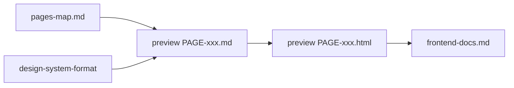

Doc ID: DESIGN-WORK-RULES-001
Status: draft
Source of truth: yes
Owner: design
Related docs: docs/project/design-guide/pages-map.md, docs/project/design-guide/design-system-format/work-rules-design-system-format.md, docs/project/design-guide/design-system-preview/work-rules-design-system-preview.md, docs/project/design-guide/design-system-preview/design-system-preview.md
Update together with: pages-map.md, design-system-preview.md
Update trigger: изменение структуры design-guide, правил preview или связи с pages-map
Review required: design, product
Maturity: L1

# Work Rules — Design Guide

Правила папки `design-guide`: как описывать экраны, готовить ASCII-макеты и HTML-preview до реализации во frontend.

## Структура папки

| Путь | Назначение | Source of truth |
|---|---|---|
| `work-rules-design-guide.md` | правила раздела design-guide | yes |
| `pages-map.md` | карта страниц, зон, навигации, связей с flow/feat | yes (структура экранов) |
| `design-system-format/` | токены и правила UI: цвета, типографика, layout, компоненты | yes (визуальные правила) |
| `design-system-preview/` | ASCII-спеки и HTML-рендер конкретных страниц | `.md` — yes; `.html` — визуализация |

## Порядок работы

1. **pages-map.md** — зафиксировать Page ID, route, роли, зоны экрана, переходы.
2. **design-system-format/** — базовые layout rules и компоненты (до детальных preview).
3. **design-system-preview/*.md** — ASCII-wireframe и описание зон для каждой страницы.
4. **design-system-preview/*.html** — HTML-рендер строго по своему `.md` и правилам из `design-system-format/`.
5. **frontend-docs.md** — маршруты и реализация после утверждения preview.

## Связь documents

- `pages-map.md` не дублирует детальный ASCII — только структуру зон и ссылки на preview-файлы.
- Детальный wireframe живёт в `design-system-preview/PAGE-xxx-*.md`.
- HTML не может расходиться с `.md`-спекой; при изменении макета сначала обновляется `.md`.
- Навигация, роли и flow — из `pages-map.md`; пошаговое поведение — в `docs/project/user-flow.md`.

## Naming preview-файлов

Формат: `PAGE-{ID}-{slug}.md` / `PAGE-{ID}-{slug}.html`

| Page ID | Slug | Пример |
|---|---|---|
| PAGE-001 | login | `PAGE-001-login.md` |
| PAGE-002 | manager-dashboard | `PAGE-002-manager-dashboard.md` |
| PAGE-003 | clients-to-review | `PAGE-003-clients-to-review.md` |
| PAGE-004 | review-history | `PAGE-004-review-history.md` |
| PAGE-005 | ai-analytics | `PAGE-005-ai-analytics.md` |
| PAGE-006 | system-settings | `PAGE-006-system-settings.md` |
| PAGE-007 | ai-agent-manager | `PAGE-007-ai-agent-manager.md` |
| PAGE-008 | employee-dashboard | `PAGE-008-employee-dashboard.md` |
| PAGE-009 | ai-agent-employee | `PAGE-009-ai-agent-employee.md` |

Индекс preview: `design-system-preview/design-system-preview.md`.

## Обязательная структура preview `.md`

Каждый preview-файл страницы содержит:

1. Паспорт (Doc ID, Page ID, Related docs).
2. **Layout shell** — какой каркас: `SHELL-AUTH`, `SHELL-MANAGER`, `SHELL-EMPLOYEE`.
3. **Zones** — таблица зон с ID, назначением и компонентами.
4. **ASCII wireframe** — блок в fenced code, отражающий зоны.
5. **States** — loading / empty / partial / error / forbidden для страницы.
6. **Links** — переходы на другие Page ID.

## Правила ASCII

- Использовать box-drawing: `+`, `-`, `|`.
- Подписывать зоны как в `pages-map.md`: `Z-HEADER`, `Z-NAV`, `Z-MAIN` и т.д.
- Не рисовать пиксель-perfect UI — только компоновку и иерархию блоков.
- Один ASCII на страницу; варианты состояний — отдельными маленькими блоками при необходимости.

## Правила HTML preview

- Один HTML на страницу; имя совпадает со slug `.md`.
- Семантическая разметка: `header`, `nav`, `main`, `section` по зонам.
- Стили — минимальные, из `design-system-format/` (когда заполнены); до этого — нейтральный wireframe CSS.
- HTML не добавляет блоки, которых нет в ASCII-спеке.

## Что не делать

- Не описывать API и backend-логику в design-guide.
- Не дублировать user-flow пошагово — только ссылка на FLOW-xxx.
- Не начинать frontend-реализацию без Page ID и preview-спеки для MVP-страниц.

## Related Docs

- `pages-map.md`
- `design-system-preview/design-system-preview.md`
- `design-system-format/page-layout-rules.md`
